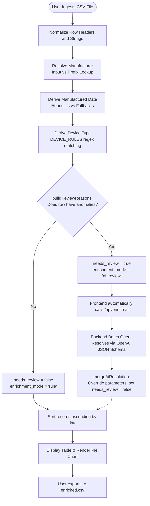
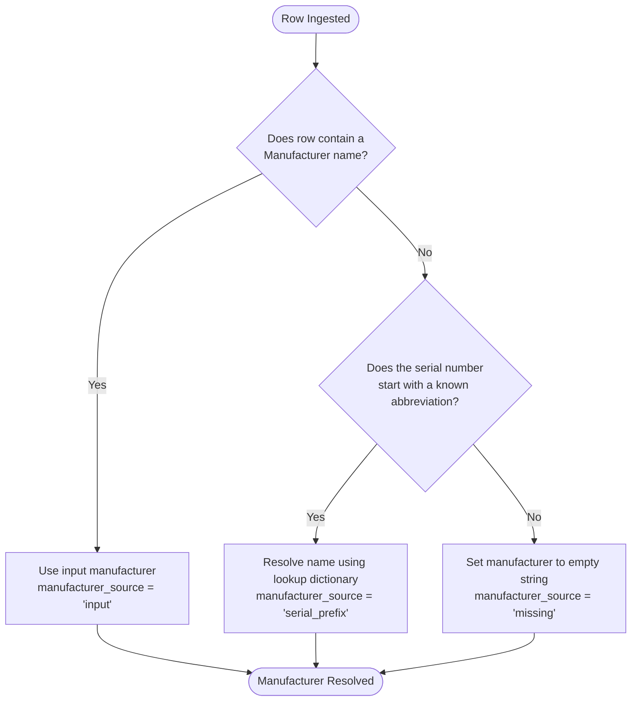
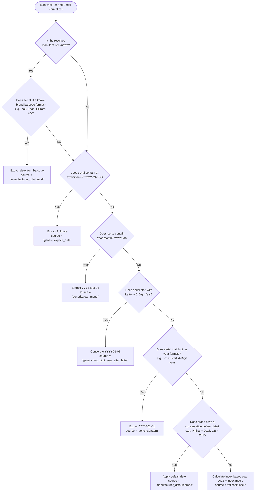
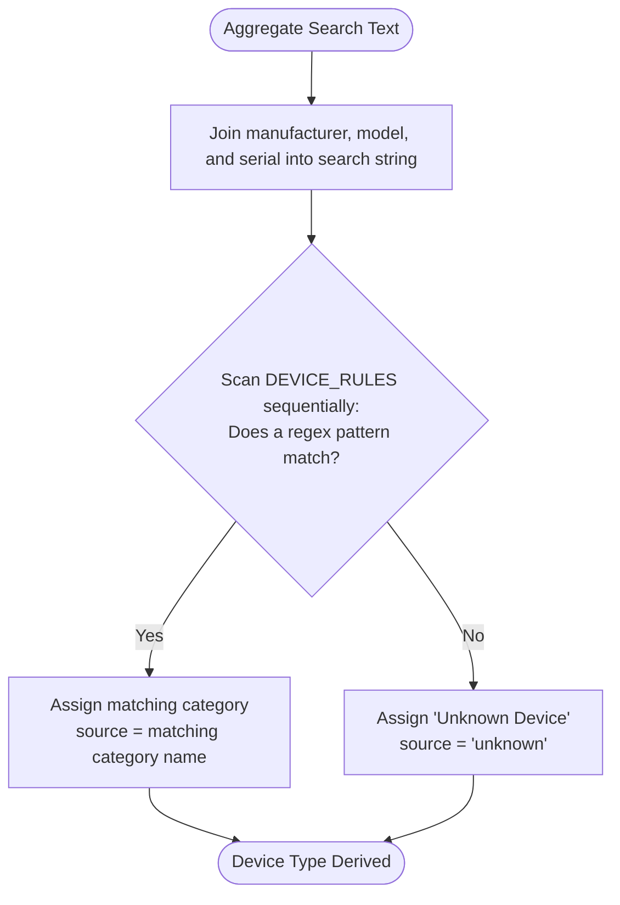
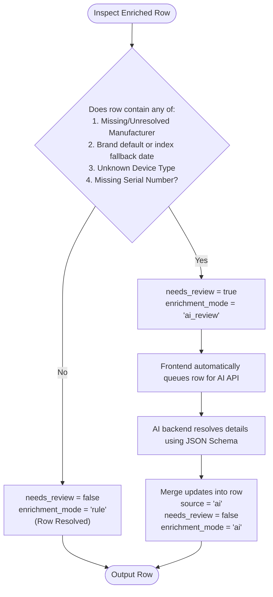

# Equiply Enrichment Console

A medical equipment inventory enrichment console built with React, Vite, and custom Node server middleware. This dashboard parses raw hospital equipment datasets (CSV files containing manufacturer, model, and serial number), standardizes metadata, and derives correct classifications and dates of manufacture using a hybrid deterministic-and-AI pipeline.

## 🩺 Industry Standard Frameworks

For healthcare asset management, capital planning, and lifecycle modeling (the core functions of platforms like Equiply), records are enriched using classifications derived from two primary data frameworks:
1.  **The American Hospital Association (AHA) Estimated Useful Lives (EUL) Guidelines**: The healthcare industry standard for determining how many years a specific piece of equipment should remain in service before replacement (lifecycle planning).
2.  **The U.S. Food and Drug Administration (FDA) Device Classification**: Classification codes that rank equipment by safety and regulatory control requirements (Class I for low risk, Class II for intermediate risk, and Class III for high risk/sustained life support).

The regex pattern matching rules inside `DEVICE_RULES` are programmatically mapped directly to matching standardized nomenclature in these databases.

---

## 🚀 Features

*   **CSV File Ingestion**: Upload custom spreadsheet logs or load standard challenge datasets directly.
*   **Deterministic Parsing Heuristics**: Custom regular expression models match serial barcodes from major brands (Zoll, Hillrom, Edan, Welch Allyn, Covidien, Masimo, BioSonic, Cogentix, Hospira, Thermo) to derive dates instantly.
*   **Device Type Classification**: Automated string-matching regex rules classify devices into 29 clinical types.
*   **Quality & Confidence Audit**: Tracks extraction lineage (`input`, `serial_prefix`, `ai`, etc.) and scores confidence from `40%` to `100%`.
*   **Targeted AI Fallback (Hybrid Flow)**: Ambiguous rows that fail heuristic parsing are flagged for review and solved asynchronously using an OpenAI Structured Outputs backend.
*   **Analytics Visualization**: Renders distribution mix of device categories in real-time.
*   **Data Export**: Downloads a sorted, fully enriched CSV matching hackathon submission requirements.

---

## 🛠️ Setup & Installation

### 1. Prerequisites
Make sure you have [Node.js](https://nodejs.org/) (version 18 or higher) and `npm` installed.

### 2. Install Dependencies
Clone the repository, navigate to the folder, and run:
```bash
npm install
```

### 3. Configure the Environment
Create a `.env` file at the root of the project to add your OpenAI API key:
```ini
OPENAI_API_KEY=your-api-key-here
```

---

## 💻 Running the Application

### Start the Development Server
To launch both the React frontend and the backend API middleware, run:
```bash
npm run dev
```

Once running, navigate to:
*   **Local**: [http://localhost:5173/](http://localhost:5173/)
*   **Network**: http://192.168.2.106:5173/

---

## 🔧 Command Line Utility

You can also run the enrichment logic directly on a local CSV file using the Node CLI script. It reads `challenge_data-v1.csv` and outputs `enriched.csv`.

Run the script:
```bash
node --env-file=.env scripts/enrich-with-openai.mjs
```

---

## 📐 How the Enrichment Rules Work

The console runs a **three-stage evaluation**:

1.  **Normalization**: Trim fields and standardize keys (e.g. `SerialNumber` -> `serial_number`).
2.  **Date Matching Heuristics**: Runs the serial code through manufacturer patterns (e.g. Zoll's `[Letters][2-Digit Year][Month Letter]` format, Edan's `M[2-Digit Year]` format).
3.  **Device Classification**: Joins manufacturer, model, and serial metadata to scan against regular expressions representing standard categories (e.g. matches `puritan` to `Ventilator`, `voluson` to `Ultrasound`).
4.  **AI Fallback**: If a row has an unresolved manufacturer, unknown device type, or missing serial, the app flags it for review (`needs_review: true`) and passes only those ambiguous rows to the LLM backend for structured resolution.

---

## 🗺️ Visual Decision Trees & Flowcharts

To make the multi-stage parsing logic easily auditable, we have compiled the rules-engine decisions and data routing flows into interactive diagrams:

*   **Interactive HTML Dashboard**: Open [decision_tree.html](file:///Users/ruchirjoshi/Projects/equiply-enrichment-console/decision_tree.html) in any browser to explore the logic with color-coded, smooth-tabbed diagrams and code blocks.
*   **Static Markdown Diagrams**: See [decision_tree.md](file:///Users/ruchirjoshi/Projects/equiply-enrichment-console/decision_tree.md) to inspect the Mermaid.js source diagrams directly on GitHub.

These flowcharts map the entire path of a row:
1. **Global Overview**: The end-to-end user ingest to AI fallback queue and sorting.
2. **Manufacturer Identification**: Sanitization and serial number prefix dictionaries.
3. **Date Heuristics**: Zoll, Edan, Hillrom, ADC decoders and generic year/month fallbacks.
4. **Device Category Matching**: Sequential regex scan boundaries.
5. **AI Validation & Routing**: Point deductions, threshold confidence scoring, and OpenAI JSON Schema batch queueing.

---

### 🗺️ End-to-End System Flowchart

Here is the global data flow showing how a CSV file goes from ingestion, through local rules-based parsing, automatic AI review, sorting, and final export.



---

### 1. Manufacturer Identification

#### Decision Flowchart


#### Logical Breakdown
1.  **Step 1: Check Input**: The system first inspects the `manufacturer` column. If a non-empty name exists, it sanitizes/trims the string and tags `manufacturer_source` as `'input'`.
2.  **Step 2: Prefix Matching**: If the manufacturer is blank, it splits the serial number by spaces, hyphens, or underscores and checks the first word (the prefix) against `MANUFACTURER_PREFIXES` in [enricher.js](file:///Users/ruchirjoshi/Projects/equiply-enrichment-console/src/utils/enricher.js#L31):
    *   `ge` $\rightarrow$ **GE Healthcare**
    *   `philips` or `ph` $\rightarrow$ **Philips**
    *   `siemens` or `sie` $\rightarrow$ **Siemens Healthineers**
    *   `mdt` $\rightarrow$ **Medtronic**
    *   `bax` $\rightarrow$ **Baxter**
3.  **Step 3: Missing**: If both checks fail, the manufacturer is set to empty and flagged as `'missing'`.

##### 📝 Examples:
*   `"GE Healthcare", "Voluson E8"` $\rightarrow$ **GE Healthcare** (Source: `input`)
*   `"", "spect-iq", "bax-901842"` $\rightarrow$ **Baxter** (Source: `serial_prefix` - matched `bax` prefix)

---

### 2. Date of Manufacture Derivation

This stage executes the `deriveManufacturedDate` function in [enricher.js](file:///Users/ruchirjoshi/Projects/equiply-enrichment-console/src/utils/enricher.js#L141).

#### Decision Flowchart


#### Logical Breakdown
1.  **Manufacturer-Specific Rules**: If the manufacturer matches a known brand, the parser looks for proprietary serial patterns:
    *   *Edan*: Matches `M` + 2-digit year (e.g. `M19` $\rightarrow$ `2019-01-01`).
    *   *Zoll*: Matches letters + 2-digit year + letter A-L for month (e.g. `T14B...` $\rightarrow$ `2014-02-01`).
    *   *Hill-Rom*: Looks for ending year strings `1998`/`1999`, or model checks (e.g., `Century` model defaults to `1999-01-01`, `P1440` to `2016`).
    *   *American Diagnostic*: Matches starting 2 digits as a year (e.g. `C15...` $\rightarrow$ `2015-01-01`).
    *   *BioSonic / Cogentix*: Matches 2-digit year + 2-digit month.
2.  **Generic Fallback Rules**: If no manufacturer matches, the script falls back to parsing common date formats:
    *   *Explicit Date*: Matches strings like `2021-05-15` or `20210515`.
    *   *Year-Month*: Matches `2021-05` (defaults day to `01`).
    *   *Year-Only Patterns*: Extracts any 4-digit numbers starting with `19` or `20`.
3.  **Default & Fallback Strategy**:
    *   *Manufacturer Average*: If no date is found but the brand is known, it applies a default brand average (e.g. Philips $\rightarrow$ `2018-01-01`).
    *   *Deterministic Year Index*: If no data exists, it applies `2016 + (index % 9)` to yield a mock date so the records can still sort.

---

### 3. Device Type Classification

#### Decision Flowchart


#### Logical Breakdown
1.  **Search Text Assembly**: The system joins the manufacturer name, model number, and serial number (lowercase) to create a single string.
2.  **Sequential Regex Scanning**: It loops through `DEVICE_RULES` in [enricher.js](file:///Users/ruchirjoshi/Projects/equiply-enrichment-console/src/utils/enricher.js#L1) and executes regex matches:
    *   *Example: Ventilator* $\rightarrow$ checks for `vent`, `vnt`, `puritan`, `respir`, `bellavista`, `servo`, `hamilton`
    *   *Example: Ultrasound* $\rightarrow$ checks for `ultra`, `voluson`, `vivid`, `logiq`, `affiniti`, `epiq`, `sonosite`, `acuson`
3.  **Boundary Protection**: Sensitive keywords are bounded by `\b` word anchors. E.g., the `X-Ray` rule utilizes `\brad\b` so it only flags standalone radiologic labels, preventing false positives like `Masimo RAD8` (which resolves as a `Pulse Oximeter`).

---

### 4. Anomaly Validation & AI Review Routing

#### Decision Flowchart


#### Logical Breakdown
1.  **Validation Check**: The rule engine reviews the output. If a row was assigned a default date, has an unknown type, or lacks a serial/manufacturer, it sets `needs_review: true`.
2.  **Automated AI Enrichment**:
    *   The frontend intercepts rows where `needs_review` is true and sends *only* those rows to the local proxy `/api/enrich-ai`.
    *   The backend queues and batches the records (groups of `10`) to perform a structured schema request to OpenAI.
    *   The LLM parses, identifies, and fills in the gaps.
3.  **Final Integration**: Enriched parameters are merged, setting `needs_review` to `false` and documenting the update source as `'ai'`.

---

## 📺 Demonstration Video

Here is a walkthrough demonstration of the Equiply Enrichment Console, showcasing the parsing solutions, user interface elements, and the automated hybrid AI enrichment workflow in action:


*(If the player does not load, you can download or watch the file directly here: [explanation_video.mp4](explanation_video.mp4))*
